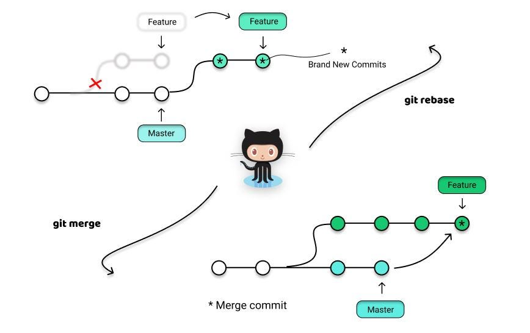
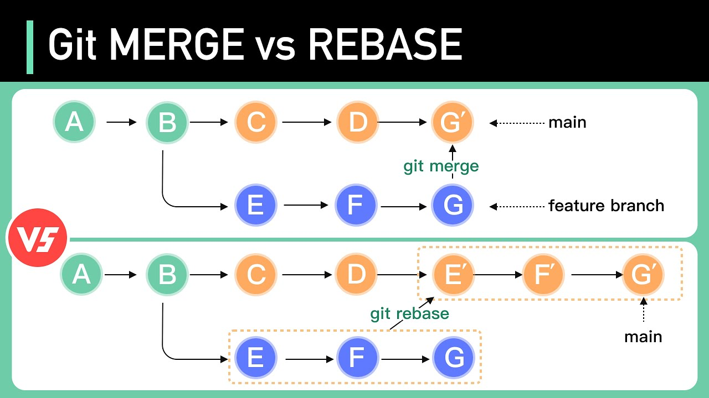

### Annotated Version vs Lightweight Version

### Annotated Version
An **Annotated Version** is a type of tag in Git that stores additional metadata about a specific commit, including:
- Tagger's name and email.
- A message (can describe the tag's purpose).
- The date of tagging.
- A checksum for integrity.

**Use case:**
Annotated tags are ideal when you need to provide a description or record of why a tag was created. These tags are often used for release versions (e.g., `v1.0.0`).

### Lightweight Version
A **Lightweight Version** is simply a reference to a specific commit. It does not include any metadata or message.

**Use case:**
Lightweight tags are useful for temporary tags or when you do not require additional information about the tag.

| Feature                  | Annotated Tag                  | Lightweight Tag          |
|--------------------------|---------------------------------|--------------------------|
| Metadata                | Includes a message and author details. | No additional metadata. |
| Use Case                | For official releases or milestones. | For quick and temporary tagging. |
| Command to Create       | `git tag -a <tag_name> -m <message>` | `git tag <tag_name>`     |
| Terminal Display        | Shown with `git show <tag_name>`. | Not displayed with `git show`. |

---

### Rebase vs Merge

### Rebase
Rebasing takes the changes from one branch and applies them on top of another branch, creating a linear history.

**Use case:**
- Cleaning up commit history before sharing with others.
- Keeping a project history easier to understand by avoiding merge commits.

### Merge
Merging combines two branches, creating a new commit that represents the integration of both branches.

**Use case:**
- Preserving the complete history of all changes.
- Collaborating on a feature branch with multiple contributors.

| Feature                  | Rebase                         | Merge                   |
|--------------------------|---------------------------------|--------------------------|
| Workflow Impact         | Rewrites commit history.       | Preserves full commit history. |
| Use Case                | For clean, linear history.     | For keeping a complete history of changes. |
| Command to Perform      | `git rebase <branch>`          | `git merge <branch>`     |
| Pros                    | Cleaner history for production. | Easier to track what happened when. |
| Cons                    | History rewriting can be risky. | Can create merge conflicts. |

### Key Differences
| Aspect             | Rebase                      | Merge                      |
|--------------------|-----------------------------|----------------------------|
| History            | Linear                     | Non-linear (merge commits) |
| Use case           | Clean history              | Preserve history           |
| Risk of conflicts  | High (applies commits one by one) | Lower                     |

---

## Image Example

